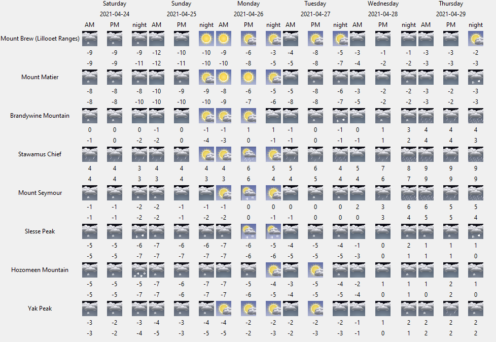

# Mountain-Forecasts
Script to display mountain weather forecasts for multiple peaks in a single window using mountain-forecast.com data.

I frequently use the website mountain-forecast.com to decide on weekend trip destinations. This can involve a lot of clicking around to find which peaks will have the best weather. I made this script so I can quickly see information for prominent peaks in my area in a single screen.

Special thanks to [this](https://towardsdatascience.com/web-scraping-mountain-weather-forecasts-using-python-and-a-raspberry-pi-f215fdf82c6b) write-up by Andres Vourakis.

